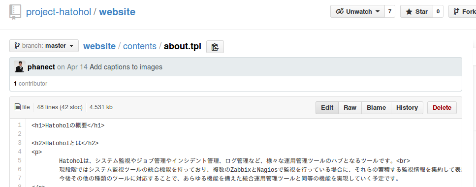
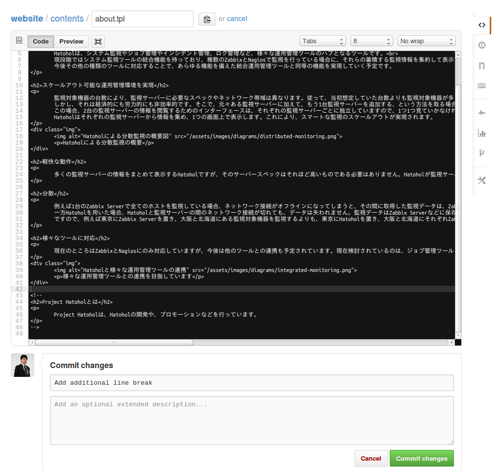
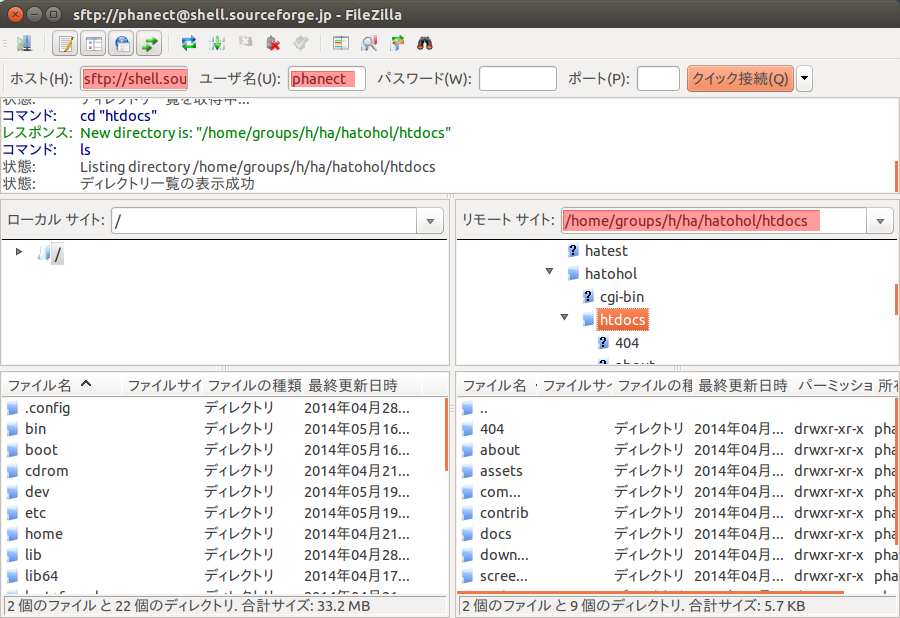

編集とデプロイ
=============
このドキュメントでは、[Hatohol Webサイト](http://www.hatohol.org)の編集方法を説明します。

流れとしては、以下のようになります。

1. ファイルを編集する
2. コンパイル用スクリプトの依存パッケージをインストールする
3. コンパイルを行う
4. デプロイを行う

1. ファイルを編集する
-------------------
編集の方法としては

 - git で clone し、ローカルで編集した後 Github に push する
 - Github の Web インターフェース上で編集を行う

の2種類があります。
ここでは後者の、Web インターフェース上で行う方法を説明します。

(1) Github に[ログイン](https://github.com/login)します。

(2) [Web サイトのリポジトリー](https://github.com/project-hatohol/website)を開き、編集したいファイルを開きます。

(3) ファイル右上の_Edit_ボタンを押します。



(4) エディター上で編集できるようになりますので、編集を行います。  
編集が完了したら、変更内容を (できれば英語で) 記入し、_Commit Changes_ をクリックします。



以上で編集は完了です。

2. コンパイル用スクリプトの依存パッケージをインストールする
---------------------------------------------------
HTMLファイルを生成するために、コンパイルを行う必要があります。
gen.pyがファイルを自動的にコンパイルします。

gen.pyの動作には、以下のライブラリー群が必要です。

- Python 3
- python-markdown
- unoconv
- Sass

以下は、Ubuntu 14.04において、上記パッケージをインストールするためのコマンドです。

```shell
    sudo apt-get install python3 python3-markdown unoconv ruby-dev
    sudo gem install sass
```

3. コンパイルを行う
-----------------
gen.pyは、HTML、CSS、画像などのファイルを自動的に生成します。

まずはこのリポジトリーをgitでクローンするか、または[Zipでダウンロード](https://github.com/project-hatohol/website/archive/master.zip)して展開して下さい。

その後、gen.pyのあるディレクトリーに移動し、以下のコマンドを実行して下さい。

    ./gen.py --output <出力先ディレクトリー>

unoconvの変換エラー防止のため、LibreOfficeは全て停止して下さい。

4. デプロイを行う
---------------
Ubuntu 環境を前提としています。  
現在は sourceforge.jp のホスティングサーバーを利用しています。詳細は[sourceforge.jp の公式ドキュメント](http://sourceforge.jp/docs/FrontPage#h2-Web.E3.82.B5.E3.82.A4.E3.83.88.E3.81.AE.E3.83.9B.E3.82.B9.E3.83.86.E3.82.A3.E3.83.B3.E3.82.B0.E3.81.AB.E9.96.A2.E3.81.99.E3.82.8B.E6.96.87.E6.9B.B8)を確認して下さい。

1. sourceforge.jp のアカウントを持っていない場合は、[アカウントを作成](https://sourceforge.jp/account/register.php)して下さい。

2. SSH キーを生成していない場合は、生成して下さい。方法は[こちらの記事](http://qiita.com/phanect/items/b5160831c51246d44d72)を参照して下さい。

3. 自分のハードディスク上の /home/<OS ユーザー名>/.ssh/id_rsa.pub の中身のテキストを全てコピーし、 [sourceforge.jp の設定ページ](https://sourceforge.jp/account/editsshkeys.php)で「新しい SSH 公開鍵を追加」ボタンを押し、表示されたテキストボックスに貼り付けて下さい。

4. 最新の Ubuntu の場合、ファイルマネージャーでアクセスできます。  
Ctrl+Lを押すと、現在のディレクトリーのパスが表示され、編集できるようになりますので、その内容を *sftp://<sourceforge.jpのユーザー名>@shell.sourceforge.jp/home/groups/h/ha/hatohol/htdocs* にします。


古い Ubuntu の場合、ファイルマネージャーのバージョンが古く、バグがある可能性があります。その場合は FileZilla など、他のアプリケーションを使って下さい。  
FileZilla の場合、上から2段目の行に、"Host:"、"Username:"、"Password:"、"Port:" という、テキストボックスが並んでいると思います。Host に sftp://shell.sourceforge.jp 、Username に sourceforge.jp のユーザー名を記入し、Enter を押します。Password と Port は空で構いません。  
ログインした後、「リモートサイト」テキストボックスに /home/groups/h/ha/hatohol/htdocs と入力します。



5. コンパイルされ生成されたHTMLファイルなどを、そこに置きます。

ソースコード
---------------

### ディレクトリー構成
    ├── contents
    │   ├── assets
    │   │   ├── images
    │   │   │   ├── diagrams     - 説明用の図 (主にODG形式)
    │   │   │   │   └── …
    │   │   │   ├── hatohol.png  - ロゴ
    │   │   │   └── screenshots
    │   │   │       └── …
    │   │   ├── javascripts
    │   │   │   └── …
    │   │   └── stylesheets
    │   │       ├── bootstrap    - BootstrapのSCSSファイル
    │   │       │   └…
    │   │       └── styles.scss  - スタイルシート
    │   ├── docs
    │   │   ├── index.md         - /docs/
    │   │   ├── install          - ドキュメント類。URLの構造は /docs/[hatoholバージョン]/[言語コード]/ となっています。
    │   │   │   ├── 13.12
    │   │   │   │   ├── en
    │   │   │   │   │   └── index.md
    │   │   │   │   └── ja
    │   │   │   │       └── index.md
    │   │   │   └── …
    │   │   └── markdown-checker - 古いMarkdown変換用スクリプト; 不要?
    │   ├── 404.md               - 404ページ
    │   ├── about.tpl            - /about/
    │   ├── commercial.tpl       - /commercial/
    │   ├── contrib.tpl          - /contrib/
    │   ├── download.tpl         - /download/
    │   ├── index.tpl            - /
    │   ├── screenshots.tpl      - /screenshots/
    │   └── updates.tpl          - /updates/
    ├── gen.py                   - HTML生成スクリプト
    ├── layouts                  - テンプレートファイル: HTMLファイル共通のヘッダー・フッター
    └── README.md

[filename].tpl と [filename].md は、[filename]/index.html に変換されます。

このリポジトリーでは、いくつかの種類のファイルはコンパイルされます。
- .tpl: HTMLテンプレートファイル。 content ディレクトリー以下の .tpl ファイルは、bodyの中身しか持ちません。これらのファイルはコンパイル時に layout/header.tpl や layout/footer.tpl と統合されます。このファイルの最初に出てくるh1タグは、ページタイトルになります。
- .md: Markdownファイル。[python-markdown](https://pypi.python.org/pypi/Markdown)によってコンパイルされた上、layout/header.tpl や layout/footer.tpl と統合されます。
- .scss: Sass ファイル。sass コマンドによって、CSSに変換されます。
- .odg: OpenDocument Graphics ファイル。unoconvによってPNGに変換されます。

